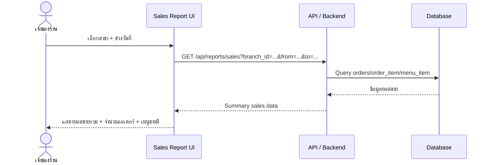

# WK10 Input / Output Design

## ระบบร้านกาแฟ (Coffee Shop POS)

งานสัปดาห์ที่ 10: ออกแบบ Input Form, Output/Report และร่าง Sequence Diagram สำหรับรายงานยอดขาย

> **หมายเหตุ:** ข้อมูลราคา ยอดขาย จำนวนออเดอร์ และข้อมูลตัวอย่างเป็นข้อมูลจำลองเพื่อใช้ในการออกแบบ ไม่ใช่ผลจาก query จริง

---

## 1. Input Form: หน้า POS รับออเดอร์

**ผู้ใช้หลัก:** พนักงานร้าน  
**เป้าหมาย:** รับออเดอร์และคำนวณราคารวมก่อนยืนยัน

### 1.1 รายละเอียด Field / Element

| Field / Element | ชนิด Input | ค่าเริ่มต้น / ตัวเลือก | Validation / Feedback |
|---|---|---|---|
| สาขา (Branch) | Dropdown | เลือกจากสาขาที่มี | ต้องเลือกสาขาก่อนแสดงเมนูของสาขานั้น |
| เมนู | Button/Card | รายการเมนูของสาขาที่เลือก | เลือกจากรายการจริง ลดการพิมพ์ผิด |
| จำนวน | Number / Stepper | 1 | ต้องเป็นจำนวนเต็มบวก (> 0) |
| รายการในตะกร้า | Table | ว่างก่อนเริ่ม | แสดงเมนู จำนวน ราคาต่อหน่วย และราคารวม |
| วิธีชำระเงิน | Radio/Dropdown | ยังไม่เลือก | ต้องเลือกก่อนยืนยันออเดอร์ |
| ยืนยันออเดอร์ | Button | Disabled | Enable เมื่อมีรายการและข้อมูลจำเป็นครบ |

### 1.2 หลักการ Input ที่นำมาใช้

| หลักการ | การนำมาใช้ในหน้า POS |
|---|---|
| Field Type ที่เหมาะสม | สาขา/วิธีชำระเงินใช้ Dropdown และเมนูใช้ปุ่ม/การ์ดแทน free text |
| Validation | จำนวนต้องเป็นจำนวนเต็มบวก และตรวจซ้ำที่ backend |
| Default Value | จำนวนเริ่มต้นเป็น 1 |
| Immediate Feedback | เมื่อเปลี่ยนจำนวนให้ยอดรวมอัปเดตทันที และแจ้งเมื่อข้อมูลไม่ถูกต้อง |
| Error Prevention | ปุ่มยืนยันถูกปิดจนกว่าจะมีรายการและข้อมูลที่จำเป็น |

### 1.3 Traceability

อ้างอิงจากโจทย์ WK10 ที่กำหนดให้ฟอร์มรับออเดอร์ต้องสอดคล้องกับ requirement/user story เรื่องการรับออเดอร์และคำนวณราคารวม และ Wireframe ต้องสืบย้อนกลับไปยัง Use Case / User Story / Acceptance Criteria

| สิ่งที่ออกแบบ | Requirement / User Story ที่รองรับ | หลักฐานในหน้าจอ |
|---|---|---|
| ฟอร์ม POS | รับออเดอร์และคำนวณราคารวม | เลือกเมนู + จำนวน + ตะกร้า + ยอดรวม |
| การเลือกเมนู | เพิ่มสินค้าในออเดอร์ | ปุ่ม/การ์ดเมนู |
| การคำนวณราคา | คำนวณยอดรวมอัตโนมัติ | ยอดรวมเปลี่ยนทันทีเมื่อจำนวนเปลี่ยน |
| การเลือกสาขา | ขอบเขตระบบหลายสาขา / branch_id | มี Branch selector ทุกหน้าจอ |

### 1.4 ตัวอย่างข้อมูลบนหน้า POS

- สาขา: **สาขา 1**
- พนักงาน: **สมชาย**
- เมนู: **Latte 45 บาท**, **Espresso 35 บาท**
- สต็อกตัวอย่าง: Latte เหลือ 12, Espresso เหลือ 8 (แสดงเตือนเมื่อสต็อกต่ำ)
- จำนวนเริ่มต้น: **1**
- วิธีชำระเงิน: **เงินสด / QR**
- ตัวอย่างยอดรวม: **90 บาท**

---

## 2. Output: ใบเสร็จ (Receipt)

**ประเภท:** Output แบบธุรกรรมเดียว ใช้แสดงผลทันทีหลังยืนยันออเดอร์

### 2.1 ข้อมูลที่ควรแสดง

| ข้อมูล | รายละเอียด |
|---|---|
| ชื่อร้าน / สาขา | แสดงชื่อระบบและสาขาที่ทำรายการ |
| เลขที่ออเดอร์ | รหัสออเดอร์ |
| วันเวลา | วันและเวลาที่ทำรายการ |
| รายการสินค้า | ชื่อเมนู จำนวน ราคาต่อหน่วย และราคารวม |
| ยอดรวม | ยอดที่ต้องชำระ แสดงเด่น |
| วิธีชำระเงิน | Cash / QR / วิธีที่ระบบรองรับ |
| พนักงาน | ผู้รับออเดอร์ |

### 2.2 ตัวอย่างใบเสร็จ

```text
----------------------------------------
                 BUU CAFE
              ใบเสร็จรับเงิน
----------------------------------------
สาขา: สาขา 1
เลขที่: ORD-20261005-001
วันที่: 05/10/2026 14:20
----------------------------------------
รายการ                    จำนวน      รวม
Latte                        1       45.00
Espresso                     1       35.00
----------------------------------------
ยอดรวม                              80.00 บาท
วิธีชำระเงิน: เงินสด
พนักงาน: สมชาย
----------------------------------------
           ขอบคุณที่ใช้บริการ
----------------------------------------
```

> ตัวอย่างนี้เป็นข้อมูลจำลองสำหรับการออกแบบ

### 2.3 หลักการ Output

- จัดลำดับข้อมูลสำคัญให้เห็นได้ชัด
- ใช้รูปแบบเหมาะกับผู้ใช้
- หลีกเลี่ยงข้อมูลที่ไม่จำเป็น
- ใบเสร็จเป็น Output ของธุรกรรมเดียว ต่างจาก Report ที่รวบรวมข้อมูลจากหลายธุรกรรม

---

## 3. Output: รายงานยอดขาย

**ประเภท:** Summary Report แบบ On-demand สำหรับเจ้าของร้าน/ผู้ดูแล

ตัวเลือกสาขาต้องแสดงทุกหน้าจอ และรายงานสามารถต่อยอดเป็น Comparative Report เพื่อเปรียบเทียบยอดขายระหว่างสาขาได้

### 3.1 ข้อมูลใน Summary Report

| ส่วน | ข้อมูล |
|---|---|
| ตัวกรอง | สาขา + วันที่/ช่วงเวลา |
| ยอดขายรวม | ยอดขายรวมของช่วงเวลาที่เลือก |
| จำนวนออเดอร์ | จำนวนรายการออเดอร์ |
| เมนูขายดี | จัดอันดับเมนูตามยอดขาย/จำนวน |
| ตารางสรุป | เมนู, จำนวนที่ขาย, ยอดขาย |

### 3.2 ตัวอย่างข้อมูลจำลอง

- ช่วงวันที่: **01/10/2026 ถึง 05/10/2026**
- สาขา: **สาขา 1**
- ยอดขายรวม: **8,450 บาท**
- จำนวนออเดอร์: **62 รายการ**
- เมนูขายดี: **Latte — 45 รายการ**

| เมนู | จำนวนที่ขาย | ยอดขาย |
|---|---:|---:|
| Latte | 45 | 2,025 บาท |
| Cappuccino | 32 | 1,440 บาท |

> ตัวเลขเป็นข้อมูลจำลองเพื่อใช้ในการออกแบบ ไม่ใช่ผลจาก query จริง

### 3.3 หลักการออกแบบ Report

- เน้นข้อมูลสรุปเพื่อช่วยวิเคราะห์ มากกว่ารายละเอียดของธุรกรรมแต่ละรายการ
- มี Filter ช่วงวันที่และสาขา
- แสดงตัวชี้วัดสำคัญ เช่น ยอดขายรวม จำนวนออเดอร์ และเมนูขายดี
- ใช้ตาราง/กราฟช่วยให้มองเห็นข้อมูลได้เร็ว
- สามารถต่อยอดเป็น Comparative Report สำหรับเปรียบเทียบสาขาได้

---

## 4. Draft Sequence Diagram: GET /api/reports/sales

**Participant:** เจ้าของร้าน/ผู้ดูรายงาน, UI, API/Backend, Database



### 4.1 ลำดับการทำงาน

| ลำดับ | Participant | การทำงาน |
|---:|---|---|
| 1 | เจ้าของร้าน | เลือกสาขาและช่วงวันที่ |
| 2 | UI | ส่ง GET request ไปยัง `/api/reports/sales` พร้อม filter |
| 3 | API / Backend | รับ request และประมวลผลเงื่อนไขรายงาน |
| 4 | Database | Query ข้อมูล orders / order_item / menu_item |
| 5 | API / Backend | ส่ง Summary sales data กลับไปยัง UI |
| 6 | UI | แสดงยอดขายรวม จำนวนออเดอร์ และเมนูขายดี |

> Sequence Diagram เป็นแบบร่างสำหรับใช้ตรวจสอบลำดับการเรียก endpoint ก่อน implement จริง

---

## 5. สรุปหลักการที่ใช้

**Input:** Field Type, Validation, Default Value, Immediate Feedback และ Error Prevention  
**Output:** Visual Hierarchy, Consistency, การเลือกข้อมูลให้เหมาะกับผู้ใช้ และไม่แสดงข้อมูลเกินความจำเป็น  
**Wireframe:** Consistency, Feedback, Error Prevention, Visibility และ Minimalist Design
